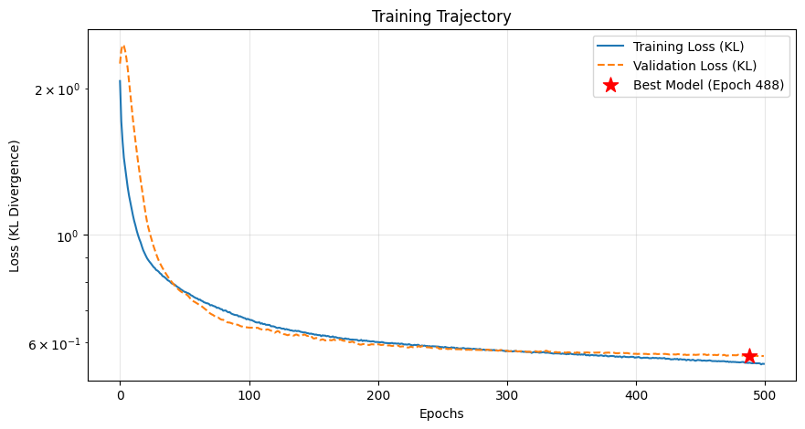

# PART ONE: Dataset Generation Report (QEM TRACK)

## 1. Overview
Generating a synthetic dataset of **10,000 random quantum circuits** to train an ML model for Quantum Error Mitigation. 

Each circuit is simulated under four conditions: 
- Ideal (Noise-free)
- Three noise levels (Low, Moderate, High)

There was also an additional generated dataset in which, instead of using three distinct noise models (Low, Moderate, High), a single noise feature was varied continuously in magnitude.

## 2. Technical Stack
- **Language:** Python 3.10
- **Environment:** Google Colab
- **Quantum SDK:** 
    - `qiskit` (Circuit generation)
    - `qiskit-aer` (Noisy simulation)
- **Data Handling:** `pandas`, `numpy`

## 3. Dataset Specifications
- **Sample Size:** 10,000 paired examples
- **Circuit Complexity:** 
    - Up to 4 Qubits
    - 2-9 Depth
    - Max 50 Gates
- **Output Format:** 
    - Probability vectors of size 16 ($2^4$), representing states $|0000\rangle$ to $|1111\rangle$

## 4. Noise Model Configuration
Used three error types. A composite noise model scales a parameter lambda $\lambda$ across the different types
1.  **Depolarizing Noise:** Gate errors applied to 1-qubit ($p=\lambda$) and 2-qubit ($p=2\lambda$) gates
2.  **Amplitude Damping:** $T_1$ relaxation applied to all qubits
3.  **Readout Error:** Measurement bit-flip probability ($p=\lambda$)

.

| Level | $\lambda$ | Description |
| :--- | :--- | :--- |
| **Low** | 0.05 | High-quality modern hardware |
| **Mod** | 0.1 | Older or noisier hardware |
| **High** | 0.15 | High-noise regime for stress testing |

## 5. Data Schema
The output file `quantum_dataset.csv` contains ~67 columns per row:

| Group | Columns | Description |
| :--- | :--- | :--- |
| **Metadata** | n_qubits, n_gates, depth | Circuit features |
| **Target (Y)** | ideal_0 ... ideal_15 | Ground truth probabilities |
| **Input (X)** | low_..., moderate_..., high_... | Noisy probability vectors for all 3 levels |

## 5. Results
After the training and testing were completed, our best validation performance had a validation loss of **0.5629**

### FINAL PERFORMANCE REPORT (Evaluated on 6000 Test Samples)
============================================================
- MSE Error (Unmitigated):   0.018641
- MSE Error (AI Model):      0.010573
------------------------------------------------------------
- R2 Score (Unmitigated):    0.1811 (Baseline Fit)
- R2 Score (AI Model):       0.3816 (AI Fit)
------------------------------------------------------------
Improvement Factor:        1.76x  
Win Rate:                  74.30%

### Graphs
============================================================  
Performance Distribution: Noise vs AI (KL-Trained)  
  

Training Trajectory (Epochs vs Loss)  
  

Robustness, Error Distribution Shift and Overall Success Rate

